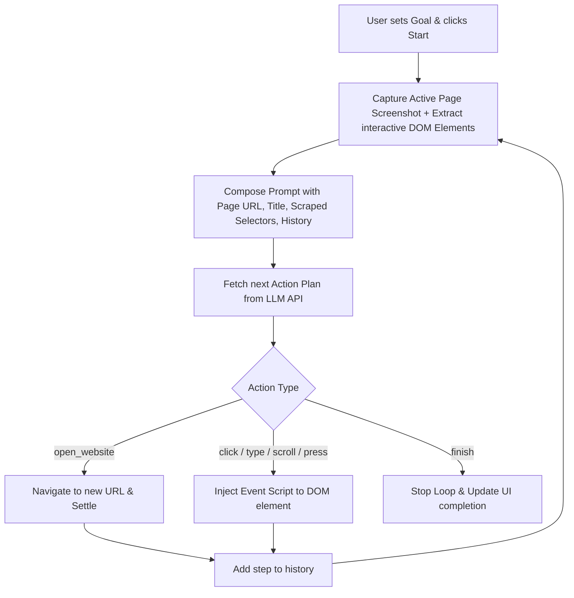

# 🤖 AutoPilot AI: Autonomous Browser Agent

AutoPilot AI is an advanced, high-performance autonomous AI browser automation agent running entirely client-side inside a Google Chrome Extension (**Manifest V3**). Built with Vite, React, and Vanilla CSS, it features a premium sidepanel UI that lets you specify high-level goals (e.g. *"Play a song on YouTube"* or *"Search Wikipedia for python programming"*) and watch the AI autonomously interact with pages in real-time.

---

<p align="center">
  
  
  
</p>

---

## ⚡ Key Features

* **📺 Live Tab Viewport Mirroring (11-12 FPS)**: Watch a real-time, scaled screenshot viewport of the active tab right inside your sidepanel workspace (Small, Medium, Large sizes).
* **⚡ Ultra-Fast Loop (0s Delay)**: Artificial rate-limit delays have been removed. Action steps resolve in under **100ms** to ensure the fastest execution speed.
* **🛡️ Hang Protection (Auto-Abort)**: API requests have a **20-second timeout** and pages have a **10-second navigation timeout** to prevent the agent from hanging silently.
* **💬 Real-Time Console Status**: The sidepanel console logs every internal retry, API call attempt (e.g. `Calling LLM API (Attempt 1/4)...`), and connection warning.
* **⏭️ Auto YouTube Ad Skipper**: Automatically scans and clicks "Skip Ad" buttons and dismisses banner ads in background content scripts.
* **🎨 Harmonious HSL Theme**: Styled with modern, high-contrast dark colors, glowing borders, custom scrollbars, and color-coded logging.

---

## 🛠️ Step-by-Step Installation Guide (Zero Node.js Setup Required)

We have pre-compiled the extension and included the `dist/` directory inside the repository. This means anyone can download and install it in Chrome in under **1 minute** without needing Node.js or any build tools!

### Option A: Install Pre-Compiled Build (Fastest - 1 Min)
1. **Download / Clone Repository**:
   * Click the green **Code** button at the top of this GitHub page and select **Download ZIP**, then extract it on your computer.
   * Or run in terminal: `git clone https://github.com/Ravish-Paul/ai-browser-agent.git`
2. **Open Extensions Page**:
   * Open Google Chrome and type `chrome://extensions/` in the URL bar.
3. **Enable Developer Mode**:
   * Turn **ON** the **Developer mode** toggle in the top-right corner.
4. **Load the Extension**:
   * Click the **Load unpacked** button in the top-left corner.
   * Select the `dist` folder located inside the `autopilot-ai/` directory of the extracted repository.
5. **Start AutoPilot AI**:
   * Open the Chrome Sidepanel or click the extension toolbar icon to launch the dashboard!

---

### Option B: Build from Source (Developers)
If you wish to make changes and compile the extension from source:
1. Make sure you have [Node.js](https://nodejs.org/) installed.
2. Open terminal in the `autopilot-ai/` directory and run:
   ```bash
   cd autopilot-ai
   npm install
   npm run build
   ```
3. Follow the Chrome loading steps above, selecting the compiled `autopilot-ai/dist/` folder.

---

## ⚙️ How to Configure & Use

1. Launch the **AutoPilot AI** sidepanel dashboard from Chrome's extensions toolbar.
2. Go to the **Settings** (⚙️) tab:
   * **API Key**: Paste your API key (supports Gemini `AIzaSy...`, Groq `gsk_...`, or OpenRouter `sk-or-...` keys).
   * **LLM Model**: Enter the model name (defaults to `gemini-2.5-flash` for Gemini keys, or use `openrouter/free`).
   * **Max Steps**: Set the step limits (e.g. 10 or 15 steps).
3. Switch back to the **Run** tab, enter a goal (e.g. *"Open youtube.com, search for a lofi song, and play it"*), and click **⚡ Run Task**!

---

## 🏗️ Folder Structure

```
├── autopilot-ai/            # Main Chrome Extension source directory
│   ├── dist/                # Pre-compiled production build (Load this in Chrome)
│   ├── public/              # Icons, manifest.json, assets
│   ├── src/
│   │   ├── ai/              # DOM element parsing, LLM prompt templates, action executor
│   │   ├── background/      # Background worker orchestrating state transitions & fetch retries
│   │   ├── content/         # Page scripts to handle DOM click & type events
│   │   ├── sidepanel/       # React components for the dashboard frontend
│   │   └── styles/          # Neon HSL themes & custom scrollbar styles
│   ├── package.json
│   └── vite.config.js       # Vite bundler options
```

---

## 📜 How It Works Under the Hood



1. **DOM Parsing**: The content script scans the active tab's DOM structure and isolates interactive targets (buttons, inputs, links) along with their coordinate boxes.
2. **Payload Compilation**: The background worker captures the viewport screenshot, packages it with page titles/selectors, and sends it to the LLM.
3. **Execution**: The LLM output acts like python statements (e.g. `click_element()`) which are parsed into actions.
4. **Error Handling**: If a target element is not found, the error stack trace is fed back to the LLM during the next step, allowing the agent to self-correct automatically.

---

## 🔒 License
Distributed under the MIT License. See `LICENSE` for more information.
