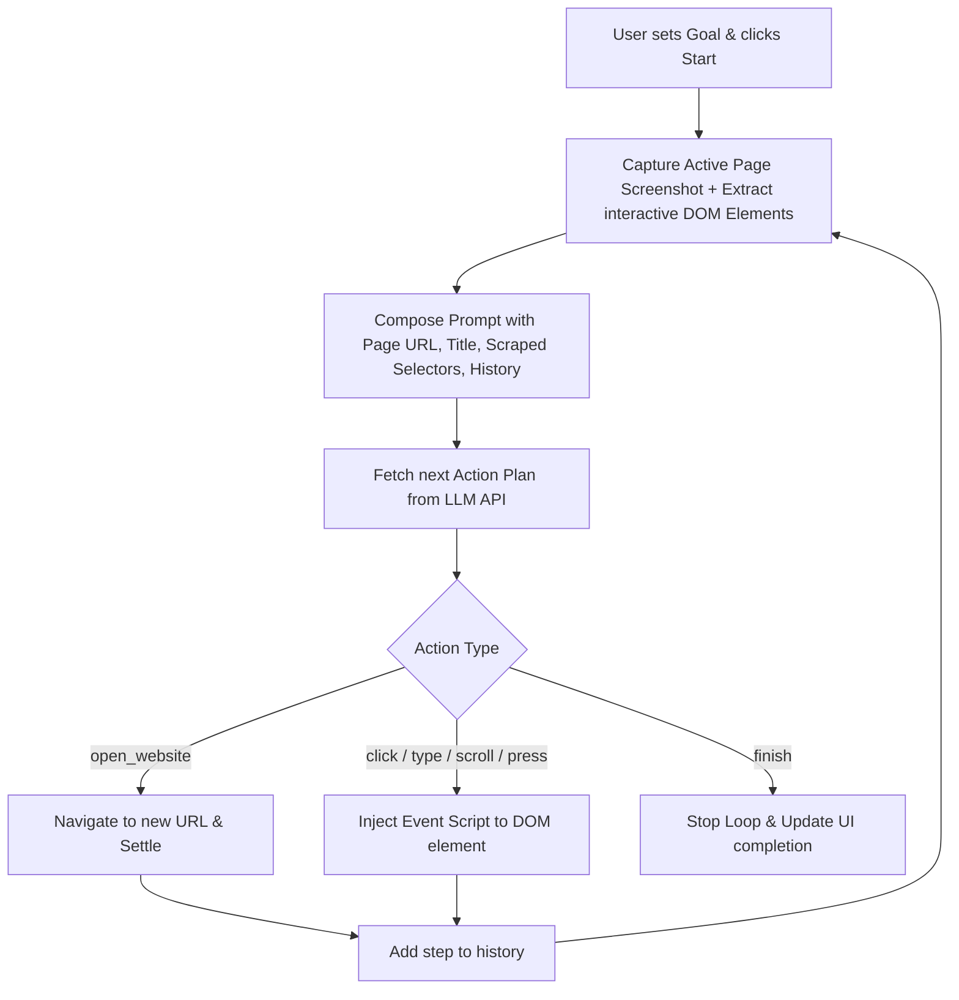

# 🤖 Autonomous AI Browser Agent: AutoPilot

AutoPilot is an advanced, high-performance autonomous AI browser automation agent running entirely client-side inside a Google Chrome Extension (**Manifest V3**). Built with Vite, React, and Vanilla CSS, it features a premium sidepanel UI that lets you specify high-level goals and watch the AI autonomously interact with pages in real-time.

---

<p align="center">
  
  
  
</p>

---

## ⚡ Key Features

* **📺 Live Tab Viewport Mirroring (11-12 FPS)**: Watch a real-time, scaled screenshot viewport of the active tab right inside your sidepanel workspace (Small, Medium, Large sizes).
* **⚡ Ultra-Fast Loop (0s Delay)**: Artificial rate-limit delays have been removed. Action steps resolve in under **100ms** to ensure the fastest execution speed.
* **🛡️ Hang Protection (Auto-Abort)**: API requests have a **20-second timeout** and pages have a **10-second navigation timeout** to prevent the agent from hanging silently.
* **💬 Real-Time Console Status**: The sidepanel console logs every internal retry, API call attempt (e.g. `Calling LLM API (Attempt 1/4)...`), and connection warning.
* **⏭️ Auto YouTube Ad Skipper**: Automatically scans and clicks "Skip Ad" buttons and dismisses banner ads in background content scripts.
* **🎨 Harmonious HSL Theme**: Styled with modern, high-contrast dark colors, glowing borders, custom scrollbars, and color-coded logging.

---

## 🛠️ Setup & Build Guide

### 1. Build the Extension
Ensure you have [Node.js](https://nodejs.org/) installed. Run these commands inside the `my-ai-extension` folder:
```bash
cd my-ai-extension
npm install
npm run build
```
This compiles the extension files and outputs them into the `dist/` directory.

### 2. Load into Google Chrome
1. Open Google Chrome and go to `chrome://extensions/`.
2. Turn **ON** **Developer mode** in the top-right corner.
3. Click the **Load unpacked** button in the top-left corner.
4. Select the `dist` folder located inside the `my-ai-extension` directory.

### 3. Usage
1. Click the **Extension icon** (or open the Sidepanel from the toolbar) to launch **AutoPilot AI**.
2. Go to **Settings** (⚙️) and configure:
   * **API Key**: Enter your Gemini, Groq, or OpenRouter API key.
   * **Model**: Choose your model (e.g., `gemini-2.5-flash` or `openrouter/free`).
3. Enter your task goal in the **Run** panel, click **⚡ Run Task**, and watch it go!

---

## 🏗️ Folder Structure

```
├── my-ai-extension/         # Chrome Extension source code
│   ├── dist/                # Production build output (Load this in Chrome)
│   ├── public/              # Static assets & Manifest V3 configuration
│   ├── src/
│   │   ├── ai/              # DOM extraction, action execution, LLM client
│   │   ├── background/      # Service worker managing state and loop transitions
│   │   ├── content/         # Content script executing physical DOM events
│   │   ├── sidepanel/       # React SidePanel frontend components
│   │   └── styles/          # Dark theme styles & scrollbar themes
│   ├── package.json
│   └── vite.config.js       # Vite configuration compiling assets
```

---

## 📜 How It Works Under the Hood



1. **DOM Parsing**: The extension's content script scans the current webpage and extracts all interactive items (buttons, inputs, links) along with their visual coordinate references and descriptions.
2. **Context Composition**: The background service worker packages this list of elements, the page screenshot, active URL, page title, and past actions list into a structured payload for the LLM.
3. **Execution**: The LLM returns a sequence of clean browser functions (like `type_text`, `click_element`, `open_website`). The script executes these actions sequentially with robust timeouts.
4. **Self-Correction**: If a selector fails to click, the error stack trace is sent back to the LLM during the next step, allowing it to adapt its strategy in real time.

---

## 🔒 License
Distributed under the MIT License. See `LICENSE` for more information.
